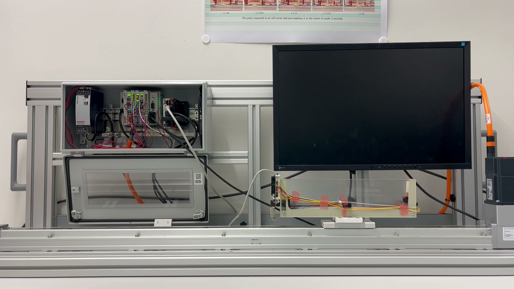
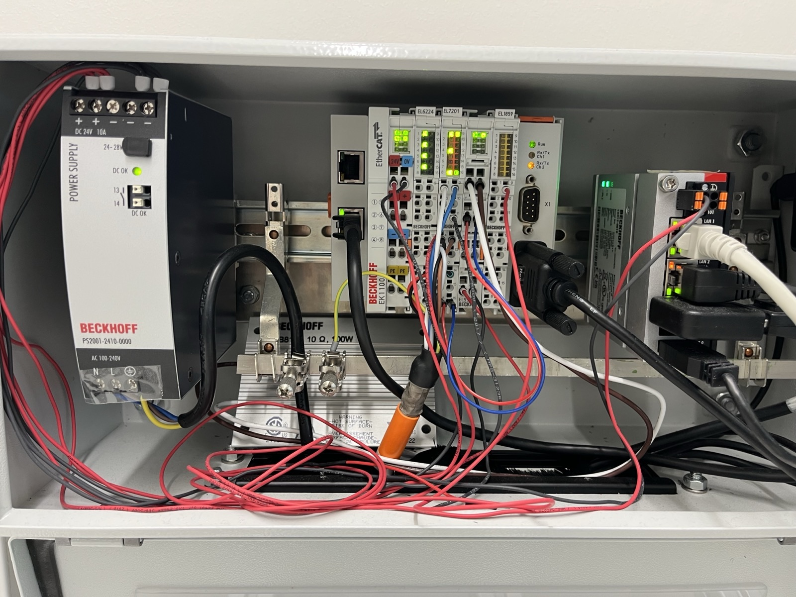

# Bill of Materials & Assembly Guide

---

## Table of Contents

1. [Bill of Materials](#bill-of-materials)
2. [System Architecture](#system-architecture)
3. [EtherCAT Terminal Stack Assembly](#ethercat-terminal-stack-assembly)
4. [Motor & Linear Actuator Assembly](#motor--linear-actuator-assembly)
5. [Sensor Assembly](#sensor-assembly)
6. [Serial & USB Wiring](#serial--usb-wiring)
7. [3D-Printed Cart](#3d-printed-cart)
8. [Power-On Sequence](#power-on-sequence)
9. [Reference Photos](#reference-photos)

---

## Bill of Materials

### Beckhoff: Control and Drive

| # | Part Number | Description | Qty | Notes |
|---|-------------|-------------|-----|-------|
| 1 | **C6015-0010** | Ultra-compact IPC, 4-core (Intel Atom E3845 via `C9900-C583` option) | 1 | Runs TwinCAT 3 runtime |
| 2 | **EK1100** | EtherCAT Coupler | 1 | Head of terminal stack; RJ-45 to IPC |
| 3 | **PS2001-2410-0000** | Power Supply Unit, 24 V DC / 10 A / 240 W | 1 | Powers the EtherCAT coupler, all EL-terminal logic, and the EL7201 motor brake output. Note: the EL7201 motor phases require a separate 8…48 V DC external supply wired to its load-voltage (Us) pins; this rig uses a 48 V DC bench supply. |
| 4 | **EL7201-0010** | 1-ch Servo Terminal, OCT, 48 V DC, 2.8 A rms (5.7 A peak for 1 s) | 1 | Drives the AM8121 via a single OCT cable. OCT (`-0010`) variant. |
| 5 | **EL9576** | Brake Chopper Terminal | 1 | Dissipates regenerative energy during rapid deceleration to keep the DC link voltage under its over-voltage threshold. Wired to the external ZB8110 braking resistor. |
| 6 | **ZB8110** | External Braking Resistor, 100 W continuous / 10 Ω | 1 | Accessory to the EL9576. **Not a DIN-rail terminal** - ships with its own mounting plate and a 1 m lead, wired to the EL9576's resistor-output terminals. |
| 7 | **EL6002** | 2-port RS-232 Serial Terminal (D-sub 9-pin × 2: X1, X2) | 1 | Host PC -> **channel 2 (X2)**; channel 1 (X1) unused. |
| 8 | **EL1859** | 8-ch Digital Input + 8-ch Digital Output (combo) | 1 | For limit switches, status signals, or auxiliary I/O |
| 9 | **AM8121-0FH0-0000** | Servo Motor, OCT, 0.50 Nm standstill torque, 4 A rms standstill current (17 A peak) | 1 | Mounted to the SMC linear actuator. The motor's 4 A continuous rating exceeds the 2.8 A rms the EL7201 can deliver continuously, so the drive is the binding constraint (more than sufficient for cart motion; the motor cannot run at its own peak torque through this drive). |

### Linear Actuator

| # | Part Number | Description | Qty | Notes |
|---|-------------|-------------|-----|-------|
| 10 | **LEFB32NXS-1000** | SMC Electric Actuator, 1000 mm stroke | 1 | Belt-driven linear slide; cart rides on this |

> **Length-unit note:** the LEFB32NXS-1000 provides 1000 mm of physical stroke, yet the drive reports positions at roughly twice that physical displacement, and the soft-limited operating window spans 1.553 m in axis units (+-0.7765 m about the centre). The factor comes from the drive's encoder scaling. The NC configuration in `hardware/twincat/axis_parameters.xml` sets `ScaleFactorNumerator = 104.8576` against `ScaleFactorDenominator = 1048576`, i.e. 1e-4 axis units per encoder increment; with the EL7201 at its default 20 single-turn bits (2^20 increments/rev) that is a feed constant of 104.8576 mm per motor revolution, which is the encoder count rescaled rather than a measured quantity. The belt drive actually advances 54 mm per revolution (the catalogued equivalent lead of the LEFB32 AC-servo variant), so reported positions run 104.8576 / 54 ~= 1.94 times the physical ones. On that factor the operating window is about 0.80 m of the 1000 mm stroke, leaving roughly 0.10 m of margin at each end for the mechanical bumpers. It changes no result: every software limit, dataset, and result uses these axis units consistently, so nothing needs converting; the factor only matters when comparing quoted track lengths against this physical part.


### Sensors (mounted on arc)

| # | Part / Link | Description | Qty | Notes |
|---|-------------|-------------|-----|-------|
| 11 | [AZ-Delivery VL53L0X](https://www.az-delivery.de/products/vl53l0x-time-of-flight-tof-laser-abstandssensor) | Time-of-Flight distance sensor breakout | 2 | I²C, 3.3 V / 5 V tolerant; one per arc edge |
| 12 | [Adafruit #2167 (Thru-Beam 508)](https://www.adafruit.com/product/2167) | IR Beam Break Sensor, open-collector | 1 pair | Emitter + receiver; mounted at arc center |
| 13 | **Arduino Uno** | Microcontroller for sensor acquisition | 1 | Reads both VL53L0X + IR beam; USB to host PC |

### Cables & Adapters

| # | Description | Qty | Notes |
|---|-------------|-----|-------|
| 14 | Beckhoff OCT motor cable (orange, ZK4000-series or equivalent) | 1 | Single cable: motor power + encoder feedback from AM8121 -> EL7201 |
| 15 | EtherCAT patch cable (RJ-45, CAT5e or better) | 1 | C6015 -> EK1100 |
| 16 | USB-to-RS232 serial adapter (FTDI / CH340) | 1 | Host PC USB <-> EL6002 channel 2 (X2) |
| 17 | USB-A to USB-B cable | 1 | Host PC <-> Arduino Uno |
| 18 | Dupont jumper wires (F-F) | ~10 | Arduino <-> VL53L0X (I²C + XSHUT) and IR sensor |

### 3D-Printed Parts & Accesories

| # | Description | Qty | Source |
|---|-------------|-----|--------|
| 19 | Cart body (rides on LEFB32NXS slide) | 1 | [`assets/stl/cart_3d_print.stl`](assets/stl/cart_3d_print.stl) |
| 20 | Motor rail mount | 1 | [`assets/stl/motor-rail.stl`](assets/stl/motor-rail.stl) |
| 21 | Base part 1 | 1 | [`assets/stl/base-part-1.stl`](assets/stl/base-part-1.stl) |
| 22 | Base part 2 | 1 | [`assets/stl/base-part-2.stl`](assets/stl/base-part-2.stl) |
| 23 | Arduino Uno mount | 1 | [`assets/stl/arduino-mount.stl`](assets/stl/arduino-mount.stl) |
| 24 | 2x Acrylic Sheets (320x90 mm, 5 mm thick) | 1 | encloses the printed cart |
| 25 | **Steel ball** (24 g, 9 mm radius / 18 mm diameter) | 1 | standard bearing ball; matches `BALL_MASS_KG=0.024`, `BALL_RADIUS_M=0.009` in `balancer/hardware/constants.py` |

> **Print settings (PLA recommended):** 0.2 mm layer height, 30 % infill, supports enabled for overhang areas.

---

## System Architecture

```
    Mains AC                       EtherCAT (RJ-45)
        |
        ▼
  ┌----------┐                ┌----------┐         ┌----------┐
  |  PS2001  |                |  C6015   +--------►|  EK1100  |
  | 24 V PSU |------ 24 V ---►|   IPC    |         | Coupler  |
  +----------┘                +----------┘         +----┬-----┘
                                                        | E-bus (EtherCAT)
                                                        |
                           ┌------------┬---------------┼---------------┐
                           |            |               |               |
                      ┌----┴----┐  ┌----┴----┐   ┌------┴---┐    ┌------┴---┐
                      | EL7201  |  | EL9576  |   |  EL6002  |    |  EL1859  |
                      | Servo   |  | Brake   |   | RS-232   |    | 8 DI +   |
                      | 48 V /  |  | Chopper |   | 2-ch     |    | 8 DO     |
                      | 2.8 A   |  |         |   |(host: X2)|    |          |
                      +----┬----┘  +----┬----┘   +-----┬----┘    +----------┘
                           | OCT        | resistor     | RS-232
                           |            | leads (1 m)  |
                      ┌----┴----┐   ┌---┴-----┐        ▼
                      | AM8121  |   | ZB8110  |   ┌----------┐
                      | Servo   |   | 10 Ω /  |   | USB-Ser. |
                      | Motor   |   | 100 W   |   | adapter  |
                      +----┬----┘   | Braking |   +----┬-----┘
                           |        | Resistor|        | USB
                      ┌----┴------┐ | (off    |        ▼
                      | LEFB32NXS | | DIN     |   ┌----------┐    ┌-------------┐
                      | 1000 mm   | | rail)   |   | Host PC  |◄-USB-- Arduino Uno
                      | + Cart    | +---------┘   | (Python) |    | VL53L0x × 2 |
                      +-----------┘               +----------┘    | + IR beam   |
                                                                  +-------------┘
```

> **Note on ZB8110:** the braking resistor is *not* an EtherCAT terminal and
> does not clip onto the DIN rail next to the other EL-series modules. It has
> its own mounting plate and is wired via a 1 m lead to the EL9576's
> resistor-output terminals. The EL9576 fires the chopper when the DC link
> voltage crosses its threshold (during motor regen), dumping the energy
> into the ZB8110.
>
> There is **no dedicated 24 V surge-protection module** in this build; the
> 24 V rail is protected by the PS2001's own output circuitry alone.

---

## EtherCAT Terminal Stack Assembly

All EtherCAT terminals clip onto a **35 mm DIN rail** and snap together
side-by-side. Observe the following left-to-right order:

```
┌--------┬--------┬--------┬--------┬--------┬--------┐
| PS2001 | EK1100 | EL7201 | EL9576 | EL1859 | EL6002 |
| 24 V   |Coupler | Servo  | Brake  | DI/DO  | RS-232 |
| PSU    |        | 48 V / |Chopper | 8+8    | 2-ch   |
|        |        | 2.8 A  |+ZB8110 |        |        |
+--------┴--------┴--------┴--------┴--------┴--------┘
```

The **ZB8110 braking resistor is not on the DIN rail**: see the Motor and
Linear Actuator Assembly section below for its wiring. The EL6002 has two
RS-232 channels on D-sub 9-pin connectors (X1 and X2); only **X2 /
channel 2** is wired to the host PC in this build, X1 is unused.

### Steps

1. **Mount DIN rail** on your base plate or enclosure back panel.
2. **Clip PS2001** on the far left. Wire mains input (L, N, PE) per the PS2001 manual. The 24 V DC output feeds the EK1100 power contacts and the rest of the bus.
3. **Clip EK1100** coupler. Connect 24 V from the PS2001 to the coupler's power input terminals. This powers the E-bus for all subsequent terminals.
4. **Clip EL7201** (servo drive terminal). 48 V DC / 2.8 A rms (5.7 A peak for 1 s); drives the AM8121 across a single orange OCT cable.
5. **Clip EL9576** (brake chopper). Dumps regen energy from the DC link into the external **ZB8110** braking resistor (wired in the next section).
6. **Clip EL6002** (2-port RS-232). Connect **channel 2 (connector X2, D-sub 9-pin)** to the USB-to-RS-232 adapter. The adapter's USB side plugs into the host PC. Channel 1 (X1) is unused.
7. **Clip EL1859** (combo digital I/O for limit switches or future expansion).
8. **Run an EtherCAT patch cable** from the C6015 IPC (X001 port) to the EK1100 "IN" RJ-45 jack.

> **Important:** Always power off the 24 V supply before clipping or unclipping terminals.

---

## Motor & Linear Actuator Assembly

1. **Mount the LEFB32NXS-1000** linear slide on your test bench / frame. Secure with M5 bolts through the actuator base mounting holes.
2. **Attach the AM8121 motor** to the actuator's drive input shaft using the appropriate coupling (supplied with the LEFB or custom).
3. **Route the OCT cable** (single orange cable) from the motor back to the **EL7201** terminal on the DIN rail. This cable carries both power and encoder feedback; no separate encoder cable is needed with OCT.
4. **Slide the 3D-printed cart** onto the actuator's carriage/slider. Secure with screws through the cart mounting holes into the carriage's threaded inserts.
5. **Mount and wire the ZB8110 braking resistor** next to the EL9576 brake chopper:
   - Screw the ZB8110's supplied mounting plate onto the enclosure back panel (or the machine frame) close enough to the terminal stack that its 1 m lead reaches the EL9576's resistor-output terminals without strain.
   - Connect the two resistor leads to the EL9576 resistor-output terminals (see the EL9576 documentation for the exact pin labels; no polarity).
   - Leave ≥ 20 mm of free air above and around the resistor; the casing is rated up to 250 °C during sustained braking.
   - Do not substitute a differently-valued resistor: the EL9576's chopper thresholds are tuned for **10 Ω / 100 W**.

---

## Sensor Assembly

The sensors are mounted on the **arc** structure above the track. The arc has a radius of **2.101 m** and is positioned so the ball rolls along it while the cart moves beneath.

### VL53L0X Placement (× 2)

```
        ┌--- Arc (R = 2.101 m) ---┐
        |                          |
   ┌----┴----┐                ┌----┴----┐
   | VL53L0X |                | VL53L0X |
   | Sensor 1|                | Sensor 2|
   | (LOX1)  |                | (LOX2)  |
   +---------┘                +---------┘
   Screwed into                Screwed into
   left slot                   right slot

              ┌--------------┐
              |  IR Emitter  |---beam---| IR Receiver |
              |  (center)    |          |  (center)   |
              +--------------┘          +-------------┘
                   glued / taped at arc apex
```

1. **Screw each VL53L0X board** into the pre-made slots at each edge of the arc. The laser aperture must face **inward / downward** toward the ball path.
2. **Glue (or tape) the IR beam-break pair** at the center of the arc, emitter on one side and receiver on the other, so the beam crosses the ball's path at the apex.

### Arduino Wiring

| Arduino Pin | Connects To | Wire Color (suggested) |
|---|---|---|
| **5V** | VL53L0X 1 VIN, VL53L0X 2 VIN, IR emitter VCC | Red |
| **GND** | VL53L0X 1 GND, VL53L0X 2 GND, IR GND | Black |
| **SDA** | VL53L0X 1 SDA, VL53L0X 2 SDA | Blue |
| **SCL** | VL53L0X 1 SCL, VL53L0X 2 SCL | Yellow |
| **D7** | VL53L0X 1 XSHUT | White |
| **A3** | VL53L0X 2 XSHUT | White |
| **D2** | IR receiver signal (open-collector output) | Yellow |

> Both VL53L0X share the I²C bus. At boot the Arduino holds one XSHUT LOW to assign unique addresses (`0x30` and `0x31`).

> The IR receiver open-collector output requires `INPUT_PULLUP` on pin D2 (configured in firmware). Beam intact -> HIGH; beam broken -> LOW (read as `1`).

---

## Serial & USB Wiring

Two USB connections run from the **host PC**:

```
Host PC
  +-- USB port A --► USB-to-RS-232 adapter --► EL6002 channel 2 / X2 (TX, RX, GND)
  |                                              (PLC serial: position/velocity stream + velocity setpoints)
  |
  +-- USB port B --► USB-B cable --► Arduino Uno
                                      (sensor serial: distance + beam data @ 115200 baud)
```

### EL6002 <-> USB-Serial Adapter

The EL6002 exposes each channel on a D-sub 9-pin connector. Wire the USB
adapter to the **X2 / channel 2** connector:

| EL6002 X2 pin | Signal  | Adapter side |
|---|---|---|
| pin 2 (RXD)   | PLC receive  | adapter TX |
| pin 3 (TXD)   | PLC transmit | adapter RX |
| pin 5 (GND)   | Ground       | GND |

> Baud rate must match on both sides: **115200, 8 data bits, no parity, 1 stop bit**.

The complete EtherCAT terminal configuration, including the EL6002 serial
settings, is stored in the shipped TwinCAT project
(`hardware/twincat/ball_on_arc/SerialCom_InfoSys_Sample1.tsproj`). Import that
project into TwinCAT to apply the exact terminal setup (CoE start-up list)
rather than transcribing the individual CoE index/subindex codes by hand.

### Arduino <-> Host PC

Standard USB-B cable. No extra wiring. The Arduino enumerates as `/dev/ttyUSB*` (Linux) or `COM*` (Windows).

---

## 3D-Printed Cart

STL files for the printable parts are in [assets/stl/](assets/stl/):

| File | Part |
|---|---|
| [cart_3d_print.stl](assets/stl/cart_3d_print.stl) | Cart body (rides on LEFB32NXS slide) |
| [motor-rail.stl](assets/stl/motor-rail.stl) | Motor mount / rail |
| [base-part-1.stl](assets/stl/base-part-1.stl) | Base assembly (part 1) |
| [base-part-2.stl](assets/stl/base-part-2.stl) | Base assembly (part 2) |
| [arduino-mount.stl](assets/stl/arduino-mount.stl) | Arduino Uno mount |

The cart mounts directly onto the LEFB32NXS carriage via screw holes on the underside. The top surface holds the arc structure and ball.

| Parameter | Recommendation |
|---|---|
| Material | PLA or PETG |
| Layer height | 0.2 mm |
| Infill | 30 % |
| Supports | Yes (for overhangs) |
| Nozzle | 0.4 mm |

---

## Power-On Sequence

| Step | Action |
|---|---|
| 1 | Verify all terminal stack wiring and OCT cable are secure. |
| 2 | Switch on the **PS2001** 24 V power supply. Confirm the EK1100 and all terminals show green LEDs. |
| 3 | Boot the **C6015 IPC**. Wait for TwinCAT to reach Run mode (or activate from XAE). |
| 4 | Plug in the **USB-to-serial adapter** and **Arduino USB** to the host PC. |
| 5 | Verify serial ports: `ls /dev/ttyUSB*` (expect two devices: one for EL6002, one for Arduino). |
| 6 | Upload Arduino firmware from WSL2: `arduino-cli upload -p /dev/ttyACM0 --fqbn arduino:avr:uno hardware/VL53L0X_Setup/dual_ir/dual_ir.ino` (full build/upload flow in [VL53L0X_Setup/README.md](VL53L0X_Setup/README.md)) |
| 7 | Start the Python framework in WSL2: `conda activate balancer`, then run the evaluation or training CLI (see [`../reproducibility_guide.md`](../reproducibility_guide.md)). |
| 8 | Confirm position/velocity data streams in the console and the cart responds to jog commands. |

> **Power-off:** Stop the PLC program first (TwinCAT -> Stop -> Log out), then switch off the 24 V supply.

---

## Reference Photos

| Description | Image |
|---|---|
| Full setup (actuator + arc + sensors, ball balanced by MPPI) |  |
| PLC / terminal stack (Beckhoff EL-terminals + IPC) |  |
