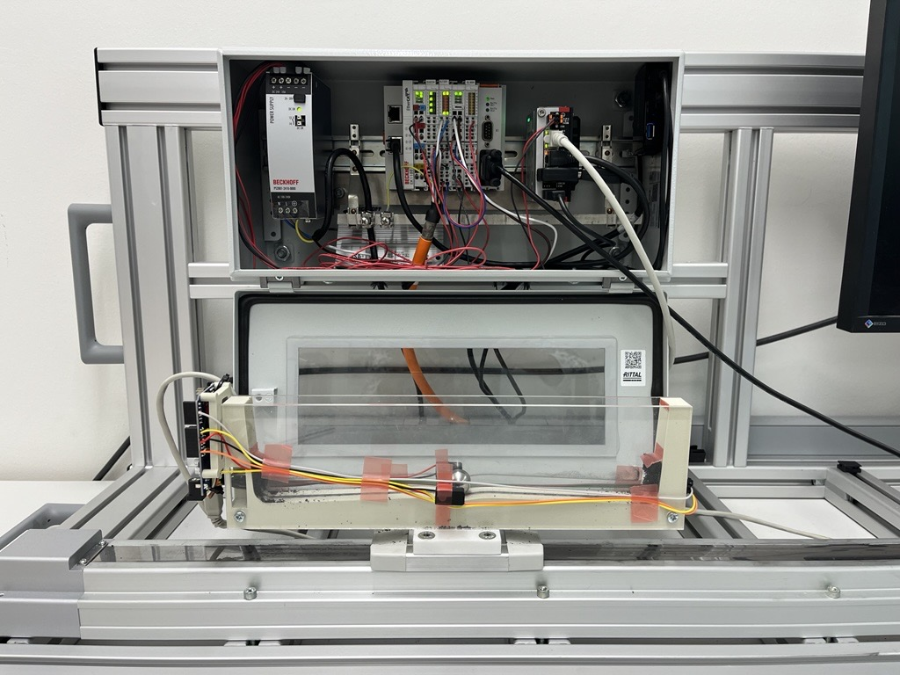

# Reproducing the Setup and Results

This guide reproduces every result in the paper, end to end: build the
hardware, collect data, train the controllers, run the evaluation, and
generate the figures and the final PDF. It does not re-explain the
per-directory READMEs or supplementary appendices I to XIV; refer to those
for detailed protocols, derivations, and diagrams.

Appendix numbers (I to XIV) below refer to the supplementary PDF. Without the
physical rig you can still train every controller (RL, world model, IQL),
tune the classical controllers, run the simulation evaluation, and
generate all figures and tables from the released datasets. Only data
collection (Stage 5) and the hardware evaluation (Stage 7.2) require the
rig. To start from the released data, skip Stage 1.

Clone the public repository and materialize its data and model files with
Git LFS before following this guide:

```bash
git clone https://github.com/JDRanpariya/ball-balancing-on-arc.git
cd ball-balancing-on-arc
git lfs pull
```

## Prerequisites

- **OS.** The full hardware-plus-software pipeline runs on Windows with
  WSL2. TwinCAT runs on a Windows host PC that connects remotely to the
  Beckhoff IPC/PLC; the Python framework runs in WSL2 on the same host and
  drives the Arduino over USB through `usbipd` (see the WSL2 USB
  passthrough walkthrough in [hardware/README.md](hardware/README.md)). This is the recommended
  setup for full reproducibility. For simulation-only work (no hardware),
  Linux (Ubuntu 22.04 or 24.04) or macOS is sufficient.
- **Python.** 3.11, installed via conda from [env.yaml](env.yaml). Package
  versions are pinned exactly in `env.yaml` and mirrored, pip-installable, in
  [requirements.lock.txt](requirements.lock.txt) (NumPy 2.2.6, SciPy 1.16.0,
  PyTorch 2.10.0, Stable-Baselines3 / sb3-contrib 2.9.0, d3rlpy 2.8.1,
  CasADi 3.7.2, OSQP 1.1.3, Gymnasium 1.0.0). Rebuild a byte-identical
  transitive lock on your platform with `pip freeze` inside a fresh env.
- **Checkpoint provenance.** The pinned environment above is the
  *verification* environment: it reproduces every released table and figure
  and loads every released checkpoint. The checkpoints themselves were
  trained earlier in the project under an older stack (Python 3.9,
  Stable-Baselines3 2.7.1, PyTorch 2.7.1; each SB3 `.zip` embeds its exact
  training environment in `system_info.txt`). Retraining from scratch under
  the pinned environment follows the same configs and seeds but is not
  guaranteed to be bit-identical to the released checkpoints.
- **Random seeds.** Online RL training uses seed 1
  (`training/configs/train.yaml`, `deterministic: True`,
  `cudnn_deterministic: True`); the LSTM world model, IQL offline RL, and the
  simulation evaluation use seed 42. Per-controller hyperparameters are in
  `training/configs/` (RL/world-model) and the offline-RL `*_config.yaml`.
- **Released revision.** In a clone, `git rev-parse HEAD` identifies the exact
  public release used for reproduction.
- **GPU.** Not required. The paper reports CPU is faster than GPU for the
  LSTM world model (Appendix VI), and all RL controllers were trained on CPU
  (Appendix V, Table 8). CPU everywhere is sufficient.
- **TwinCAT 3.** Required only for Stage 2 (PLC deploy). Beckhoff offers a
  free 7-day TC3 engineering licence; it is renewable, so a free account
  covers the full build/flash cycle.

## Stage 1: Build the hardware

Follow [hardware/BOM_AND_ASSEMBLY.md](hardware/BOM_AND_ASSEMBLY.md) for the
bill of materials, mechanical assembly, and wiring;
[hardware/README.md](hardware/README.md) documents the rig layout, sign
conventions, and calibration sources of truth.



Deliverable: the arc, ball, motor, and two VL53L0X ToF sensors mounted and
wired to the Arduino Uno and the Beckhoff EPC + EL6002 terminal.

## Stage 2: Deploy firmware and PLC

The platform spans three machines (or machine roles):

1. **Beckhoff IPC/PLC (on the rig).** The TwinCAT project lives in
   [hardware/twincat/ball_on_arc/](hardware/twincat/ball_on_arc/). From the
   Windows host PC, open it in the TC3 engineering environment, connect to
   the IPC over the network, and deploy. The active project drives
   `MC_MoveVelocity` via `FB_SerialCom_Vel` and handles both discrete and
   continuous host actions through one protocol; axis parameters are in
   [hardware/twincat/axis_parameters.xml](hardware/twincat/axis_parameters.xml).
1. **Arduino Uno (sensor board, USB-attached).** Flash
   [hardware/VL53L0X_Setup/dual_ir/dual_ir.ino](hardware/VL53L0X_Setup/dual_ir/dual_ir.ino)
   onto the Uno from WSL2 (USB exposed via `usbipd`). It does single-shot
   ToF ranging plus IR beam-break read; the host-side parser in
   [balancer/balancer/hardware/serial_reader.py](balancer/balancer/hardware/serial_reader.py)
   (`create_distance_reader`) expects exactly this serial format.
1. **Windows host PC + WSL2 (operator side).** TwinCAT engineering runs on
   the Windows host; the Python framework (evaluation, training, control)
   runs in WSL2 and talks to both the IPC (over Ethernet) and the Arduino
   (over `usbipd`-forwarded USB).

See [hardware/twincat/README.md](hardware/twincat/README.md) and
[hardware/VL53L0X_Setup/README.md](hardware/VL53L0X_Setup/README.md) for
pinouts, serial formats, and deployment status.

## Stage 3: Set up the environment

```bash
conda env create -f env.yaml
conda activate balancer
pip install -e "balancer/[all]"          # installs the `balancer` package
```

This installs the full stack: numerical core, PyTorch, SB3 + sb3-contrib
(online RL), OSQP + CasADi (MPC/NMPC), d3rlpy (offline RL / IQL), and the
hardware-only extras (`pyserial`).

## Stage 4: Calibrate the sensors

Place the ball at the centre of the arc, then run the recalibration script
in dry-run mode to inspect the offset before writing anything:

```bash
cd evaluation
PYTHONPATH=. python scripts/recalibrate_sensors.py --dry-run
```

If the printed offsets look reasonable, drop `--dry-run` to commit the
calibration to
[balancer/balancer/hardware/calibration_log.json](balancer/balancer/hardware/calibration_log.json).
See Appendix I (Sensor Characterization) and
[balancer/balancer/hardware/calibration.py](balancer/balancer/hardware/calibration.py)
for the derivation.

## Stage 5: Collect datasets

Two datasets are released (included as real files in the release
archive; in a git checkout they are Git LFS objects, and `git lfs pull`
materialises them):

| Dataset                 | File                                                                                                                                                                                                                                                 | Size                             | Use                                 |
| ----------------------- | ---------------------------------------------------------------------------------------------------------------------------------------------------------------------------------------------------------------------------------------------------- | -------------------------------- | ----------------------------------- |
| Random exploration      | [data/dataset/arcball_cont_1M_pre_neg.h5](data/dataset/arcball_cont_1M_pre_neg.h5), [arcball_cont_1M_calib196_148.h5](data/dataset/arcball_cont_1M_calib196_148.h5), [arcball_cont_1M_calib196_160.h5](data/dataset/arcball_cont_1M_calib196_160.h5) | 1 M transitions                  | World-model training; WM data sweep |
| Hardware demonstrations | [data/dataset/arcball_real_demonstrations/arcball_post_recalib_flat.h5](data/dataset/arcball_real_demonstrations/arcball_post_recalib_flat.h5)                                                                                                       | 333,497 transitions, 1,415 trials | IQL offline-RL training             |

To re-collect instead of using the released files, run
[data/collect_data.py](data/collect_data.py) then
[data/build_flat_dataset.py](data/build_flat_dataset.py) or
[data/build_real_demonstrations.py](data/build_real_demonstrations.py). See
Appendix VIII (Dataset Collection Protocol) and
[data/README.md](data/README.md).

## Stage 6: Train the learning-based controllers

A CPU is recommended for everything in this stage. The paper reports CPU
is faster than GPU for the LSTM world model (Appendix VI), and all online
RL was trained on CPU (Appendix V). Wall-clocks below are the paper's
reported numbers on an Intel i5, CPU only (Table 8); use them as a
sanity reference, not a budget.

### 6.1 World model (LSTM)

Appendix VI. The model is a small LSTM for which CPU is faster than GPU
(Appendix VI).

```bash
make train-worldmodel
# or: python training/scripts/train_world_model.py --epochs 50 --export --export-version v1
```

For model architecture, dataset format, and export options, see
[training/README.md](training/README.md) and
[balancer/balancer/world_model/](balancer/balancer/world_model/).

### 6.2 Reinforcement learning (sim-trained PPO, TRPO, SAC, TD3, TQC)

Appendix V. Trained on CPU. Per-algorithm wall-clocks from the paper:

| Algorithm | Type               | Steps | Wall-clock |
| --------- | ------------------ | ----- | ---------- |
| PPO       | on-policy, 16 envs | 3.0 M | ~40 min    |
| TRPO      | on-policy, 16 envs | 3.0 M | ~58 min    |
| SAC       | off-policy, 1 env  | 1.0 M | ~5.7 h     |
| TD3       | off-policy, 1 env  | 1.0 M | ~5.7 h     |
| TQC       | off-policy, 1 env  | 1.0 M | ~8.5 h     |

```bash
make train-ppo                                            # single algo via the Hydra entrypoint
python training/scripts/train_all_cont.py                 # batch-train all five
```

Notes:

- **wandb**: `train.py` logs to Weights & Biases by default. Without a
  wandb login (e.g. inside Docker), prefix with `WANDB_MODE=disabled`
  (or `offline`): `WANDB_MODE=disabled make train-ppo`.
- **Smoke tests**: `total_timesteps=<N>` (Hydra override) rounds up to
  at least one full on-policy rollout. For PPO that is
  `n_envs × n_steps = 16 × 2048 ≈ 33k` steps regardless of a smaller N.

For Hydra config layout, per-algorithm YAMLs, and sweep definitions, see
[training/README.md](training/README.md).

### 6.3 IQL (offline RL)

Appendix III, Offline Reinforcement Learning (IQL). Trained on the post-recalib
demonstration dataset for 500 k gradient steps using d3rlpy 2.8.1. The Make
target passes `--gpu`, which uses a CUDA GPU when one is available and falls
back to CPU automatically otherwise, so no GPU is required to reproduce it.

```bash
make train-iql
# or: cd training/offline_rl && python offline_train_cont.py --algo iql --n-steps 500000
```

For algorithms (CQL/IQL/TD3+BC/BCQ) and eval protocol, see
[training/offline_rl/README.md](training/offline_rl/README.md).
d3rlpy is included in the main `env.yaml`; no separate environment is
needed.

### 6.4 Classical controller tuning (CMA-ES)

Appendix IV and [evaluation/tuning/README.md](evaluation/tuning/README.md).
Tunes PID, LQR, SMC, MPC, NMPC, and MPPI via CMA-ES over the simulator.

```bash
cd evaluation/tuning
python tune_controllers.py --controller all
```

There is no iteration-budget flag; a full tune runs CMA-ES to its
internal convergence criteria. For a quick smoke test, run a single
controller (e.g. `--controller pid`) and interrupt once generations
start printing.

### 6.5 Real-hardware fine-tuning

Appendix XIII. Fine-tunes the best sim-trained PPO (BZ+DR) and TD3 (DR)
checkpoints directly on the real rig for 50 000 steps each, using
`BalancerReal` with an augmented reward (the balanced reward plus a binary
IR-dip signal at arc centre) and a reduced learning rate (1e-4) to avoid
catastrophic forgetting. The sim checkpoints come from Stage 6.2
(`runs/<timestamp>/best_model.zip`); load them with `model_path=` and the
fine-tuning configs in [training/configs/algo/](training/configs/algo/)
(`ppo_ft.yaml`, `td3_ft.yaml`).

```bash
python training/scripts/train.py env=real wrappers=real_wrappers \
  algo=ppo_ft model_path=<sim_checkpoint.zip> total_timesteps=50000
```

### 6.6 World-model data sweep (Finding 2, the MAE plateau)

Appendix VI. Re-trains the world model on increasing slice sizes to produce
`paper/data/wm_data_sweep/<N>/exp1_results.npz`.
[paper/check_mae.py](paper/check_mae.py) reads those `.npz` files to print
the bare-vs-WM MAE table that backs Finding 2.

```bash
cd paper/ram/scripts && python wm_data_sweep.py
python ../../check_mae.py
```

For the sweep logic and the per-slice output layout, see
[paper/ram/scripts/wm_data_sweep.py](paper/ram/scripts/wm_data_sweep.py)
and [training/README.md](training/README.md).

## Stage 7: Run the evaluation

### 7.1 Simulation evaluation

Regenerates `paper/data/exp1_sim/` plus the `sim_validation/` and
`wm_data_sweep/` `.npz` files cited by Appendices D and G.

```bash
make eval-sim        # = eval_sim.py --exp 1 --action-type cont --trials 50
```

`eval-sim` evaluates all 13 benchmark controllers in the first-order
simulator (classical, predictive, MPPI, the simulation-trained RL agents,
plus the two real-data methods PPO~(WM) and IQL). The all-controller
settling-time figure (supplement Fig.~22) reads a single canonical export;
regenerate it with

```bash
cd evaluation && PYTHONPATH=. python scripts/eval_sim.py \
    --exp 1 --action-type cont --trials 50 --seed 42 \
    --paper-export exp1_sim_all13   # -> paper/data/exp1_sim_all13/data.json
```

The paper does not use `--exp 2` (noise) or `--exp 3` (frequency); those
modes exist for development only.

### 7.2 Hardware evaluation (requires the rig)

50 stratified trials per controller: the 650-trial record that backs Table
1 and every hardware figure.

```bash
make eval-hw         # = eval.py --exp 1 --action-type cont --trials 50
```

The per-controller run aggregates under
[paper/data/exp1_hardware/sources/](paper/data/exp1_hardware/sources/) are
assembled into the master results file
`paper/data/exp1_hardware/consolidated.json`, which backs Table II and every
hardware figure, by
[data/build_consolidated.py](data/build_consolidated.py). The script embeds the
full source-to-entry provenance (also written to
`paper/data/exp1_hardware/consolidated_manifest.csv`) and, run with no
arguments, verifies that the rebuild is byte-identical to the committed file:

```bash
python data/build_consolidated.py            # verify the master file rebuilds exactly
```

## Stage 8: Analysis, figures, and the final PDF

This stage needs only the released data; no rig, no retraining.

### 8.1 Benchmark statistics and significance

[paper/scripts/compute_statistics.py](paper/scripts/compute_statistics.py) is
the single source of truth for every statistic in Table II and Section VI:
success rate with 95% Wilson score intervals, settling median [IQR] over
successful trials, RMS effort, pairwise Mann-Whitney rank tests on the
successful-trial settling times (Bonferroni over all 78 pairs), Fisher's exact
tests for success-rate differences, and Cohen's d. It prints the Table-II rows
and the significance summary and writes `data/exp1_hardware/exp1_statistics.csv`.

```bash
python paper/scripts/compute_statistics.py
```

The pairwise significance heatmap (`exp1_significance_heatmap.png`) is
regenerated by `paper/ram/regenerate_extra_figures.py` using the same
success-only Mann-Whitney test.

### 8.2 Table II verification

```bash
make table           # = python paper/verify_table1.py
```

### 8.3 Regenerate all figures

```bash
make figures-main    # main-paper figures
make figures-supp    # supplementary figures
make figures         # both at once
```

### 8.4 Build the paper PDFs

```bash
cd paper/ram && make all             # main.pdf + supplementary/supplementary.pdf
cd paper/ram && make supplementary   # supplementary/supplementary.pdf
```

## Docker reproduction (no local install)

The root `Dockerfile` builds a self-contained image using the same
conda environment (`env.yaml`) as the paper. Start from a clone after
running `git lfs pull` so it contains the real data files:

```bash
git clone https://github.com/JDRanpariya/ball-balancing-on-arc.git
cd ball-balancing-on-arc
git lfs pull
mkdir -p output
docker build -t balancer-repro .
```

All commands below run from the repo root. Outputs written to `/output`
inside the container appear in `./output/` on your host.

### Table II verification (~30 s)

```bash
docker run --rm balancer-repro python paper/verify_table1.py
```

### Regenerate the scripted figures (~5 min)

```bash
docker run --rm -v "$(pwd)/output:/output" balancer-repro make figures-docker
```

Figures are written to `paper/ram/figures/` and
`paper/ram/supplementary/figures/` inside the image. Passing a command
(like `make figures`) to `docker run` replaces the image's default CMD, so
the plain `figures` target alone will *not* copy results out before the
container exits: `figures-docker` runs `figures` and then copies the
output to `/output` when that mount is present, the same thing the default
CMD does when the image is run with no command at all.

### Benchmark statistics and significance

```bash
docker run --rm balancer-repro python paper/scripts/compute_statistics.py
```

### World-model MAE check (Finding 2)

```bash
docker run --rm balancer-repro python paper/check_mae.py
```

### Simulation benchmark: 13 controllers × 50 trials (~90 min)

```bash
docker run --rm -v "$(pwd)/output:/output" balancer-repro make eval-sim-docker
```

Results are written to `evaluation/results/sim/` inside the image;
`eval-sim-docker` runs `eval-sim` and then copies them to
`/output/eval_sim_results` (same override-CMD caveat as above).

### Interactive shell

```bash
docker run --rm -it balancer-repro bash
```

### Training (optional: pre-trained checkpoints are included)

```bash
# PPO (BZ+DR, ~40 min CPU). WANDB_MODE=disabled: no wandb login inside Docker
docker run --rm -e WANDB_MODE=disabled balancer-repro make train-ppo

# All RL algorithms
docker run --rm -e WANDB_MODE=disabled balancer-repro python training/scripts/train_all_cont.py

# World model
docker run --rm balancer-repro make train-worldmodel

# IQL offline RL
docker run --rm balancer-repro make train-iql
```

> **Note:** Hardware evaluation (Stage 7.2), sensor calibration (Stage 4),
> and dataset collection (Stage 5) require the physical rig and cannot
> be reproduced in Docker.

## Repository map

| Path                       | Contents                                                                               |
| -------------------------- | -------------------------------------------------------------------------------------- |
| [balancer/](balancer/)     | Core package: 13 controllers, sim/hardware environments, PLC + sensor interfaces       |
| [data/](data/)             | Dataset-collection scripts + released HDF5 datasets                                    |
| [evaluation/](evaluation/) | Experiment harness, sim/hardware evaluation CLIs, CMA-ES + MPPI tuning, analysis utils |
| [hardware/](hardware/)     | BOM, TwinCAT PLC project, Arduino firmware                                             |
| [training/](training/)     | Online-RL + world-model + offline-RL training scripts and configs                      |
| [paper/](paper/)           | LaTeX source, figures, released experimental data, figure + table + MAE scripts        |

## Mapping to appendices

| Appendix | Topic                                        | Where in the repo                                                                                                                                                                                                |
| -------- | -------------------------------------------- | ---------------------------------------------------------------------------------------------------------------------------------------------------------------------------------------------------------------- |
| I        | Sensor Characterization                      | [balancer/balancer/hardware/](balancer/balancer/hardware/), [hardware/VL53L0X_Setup/](hardware/VL53L0X_Setup/)                                                                                                   |
| II       | Mathematical Model                           | [balancer/balancer/core/dynamics.py](balancer/balancer/core/dynamics.py), [balancer/balancer/core/linear_dynamics.py](balancer/balancer/core/linear_dynamics.py)                                                 |
| III      | Controller Design                            | [balancer/balancer/controllers/](balancer/balancer/controllers/)                                                                                                                                                 |
| IV       | Classical Controller Tuning                  | [evaluation/tuning/tune_controllers.py](evaluation/tuning/tune_controllers.py)                                                                                                                                   |
| V        | Reinforcement Learning Training Details      | [training/scripts/train.py](training/scripts/train.py), [training/scripts/train_all_cont.py](training/scripts/train_all_cont.py)                                                                                 |
| VI       | World Model RL Training                      | [training/scripts/train_world_model.py](training/scripts/train_world_model.py), [paper/ram/scripts/wm_data_sweep.py](paper/ram/scripts/wm_data_sweep.py)                                                         |
| VII      | MPPI Controller Tuning                       | [evaluation/tuning/tune_mppi_final.py](evaluation/tuning/tune_mppi_final.py)                                                                                                                                     |
| VIII     | Dataset Collection Protocol                  | [data/collect_data.py](data/collect_data.py), [data/build_flat_dataset.py](data/build_flat_dataset.py), [data/build_real_demonstrations.py](data/build_real_demonstrations.py)                                   |
| IX       | Evaluation Protocol                          | [evaluation/experiment/initial_conditions.py](evaluation/experiment/initial_conditions.py)                                                                                                                       |
| X        | Simulation Validation                        | [paper/ram/scripts/exp1_short_horizon_prediction.py](paper/ram/scripts/exp1_short_horizon_prediction.py), [paper/ram/scripts/exp2_long_horizon_prediction.py](paper/ram/scripts/exp2_long_horizon_prediction.py) |
| XI       | Detailed Statistics and Per-Trial Data       | [paper/data/exp1_hardware/](paper/data/exp1_hardware/)                                                                                                                                                           |
| XII      | Results, Analysis, and Discussion            | [paper/ram/regenerate_figures.py](paper/ram/regenerate_figures.py), [paper/scripts/analyze_exp.py](paper/scripts/analyze_exp.py)                                                                                 |
| XIII     | Real-Hardware Fine-Tuning                    | [training/scripts/train.py](training/scripts/train.py) with `env=real` and `algo=ppo_ft` / `td3_ft`                                                                                                              |
| XIV      | Reproducibility Guide                        | this file                                                                                                                                                                                                        |

## Troubleshooting

For anything not covered here, consult the per-directory READMEs
([hardware/](hardware/), [data/](data/), [training/](training/),
[evaluation/](evaluation/), [balancer/](balancer/)) and supplementary appendices I to XIV.

Two released checkpoints are required to reproduce the RL and IQL sim
results and are noted in [evaluation/README.md](evaluation/README.md)
(RL checkpoints and Offline RL checkpoint sections): these `.zip` / `.d3`
files ship in [evaluation/models/](evaluation/models/). If they are
missing (e.g. an incomplete download), the sim benchmark silently skips
every RL controller; the world-model results and all
classical-controller results are unaffected.
